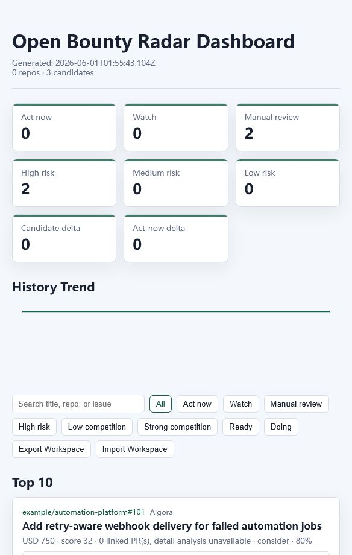

# Open Bounty Radar

[](package.json)
[](LICENSE)
[](https://www.npmjs.com/package/open-bounty-radar)
[](https://github.com/owenshuo/open-bounty-radar/actions/workflows/ci.yml)
[](docs/release.md)
[](https://owenshuo.github.io/open-bounty-radar/live/discovery-dashboard.html)
[](https://owenshuo.github.io/open-bounty-radar/demo/demo-dashboard.html)

**Open the hosted dashboards:** [Live Dashboard](https://owenshuo.github.io/open-bounty-radar/live/discovery-dashboard.html) · [Offline Demo](https://owenshuo.github.io/open-bounty-radar/demo/demo-dashboard.html)

Open Bounty Radar is a small CLI for discovering and monitoring paid open-source issues, bounty-style GitHub issues, and competitive pull request opportunities.

It helps turn scattered bounty research into a repeatable workflow:

```text
configure repos -> scan bounty issues -> score candidates -> inspect competition -> watch submitted PRs
```

It is designed for developers who want to find issues that are:

- still open
- clearly paid or bounty-backed
- not already crowded by many pull requests
- practical to review quickly from a Linux-friendly development workflow

## Who this is for

- Independent developers who want a practical bounty radar instead of manually refreshing GitHub searches.
- Open-source contributors who need to avoid already-crowded or already-solved issues.
- Small teams tracking submitted bounty PRs, maintainer comments, checks, and competitor movement.
- Builders who want a local-first workflow with explainable scoring and no hosted service requirement.

## Why this exists

Paid OSS issues are scattered across GitHub labels, issue bodies, platform comments, and project-specific conventions such as `/bounty $6000`. Developers waste time opening issues that are already solved, crowded, closed, or missing payment details.

This project turns that manual research into a repeatable scan and report.

## Project Status

Open Bounty Radar is an early-stage OSS project with a working `0.1.x` CLI surface, documented configuration, offline demo fixtures, automated tests, CI, and a release checklist. The current goal is to make bounty-related OSS contribution more transparent and less duplicative, not to encourage rushed or spammy pull requests.

Suggested repository topics: `open-source`, `bounty`, `github`, `cli`, `developer-tools`, `triage`, `pull-requests`, `oss`.

## Current MVP

- Scans configured GitHub repositories and GitHub-wide issue searches with GitHub Search API
- Detects bounty amounts such as `$250`, `$6k`, `/bounty $6000`, and `250 USDC`
- Filters closed issues by default
- Searches for pull requests that mention each issue
- Reads GitHub issue timeline cross-references to catch linked PRs search can miss
- Enriches competing PRs with draft/merged state, maintainer review signals, checks, and strength labels
- Scores candidates by bounty amount, freshness, open state, and PR competition
- Adds recommendation and risk tags such as `strong`, `risky`, `crowded`, and `special-requirements`
- Assigns risk severity levels so high-risk blockers stand out from minor warnings
- Adds action labels such as `act-now`, `watch`, `manual-review`, and `skip`
- Highlights top candidates so the report opens with the most actionable issues
- Shows linked PR competition details with state, update date, and detection source
- Writes Markdown, JSON, static HTML, and dashboard reports
- Supports GitHub search presets such as `bounty`, `external`, `recent`, `low-competition`, `crypto-bounty`, `reward`, and `amounts`
- Provides an interactive static dashboard with filters, search, copyable issue URLs, and candidate detail pages
- Includes Algora and Opire adapter foundations with optional GitHub issue enrichment
- Can extract GitHub-linked bounty listings from simple live HTML sources
- Adds local AI-style assessments with verdict, confidence, next steps, likely files, and abandon conditions
- Adds PR readiness checks for reproduction, scope, requirements, bounty, and competition risk
- Exports watchlist suggestions so promising candidates can be turned into submitted-PR monitoring entries
- Maintains optional local workspace state for candidate status and notes
- Adds watch next-action hints such as `reply`, `fix-ci`, `revise`, and `claim-or-confirm`
- Includes a GitHub Actions workflow template for scheduled runs
- Watches submitted pull requests for merge/close state, checks, reviews, and maintainer comments
- Stores state snapshots and detects meaningful changes between runs
- Sends Telegram or generic webhook notifications for detected changes

## Quick Start

Run without installing:

```bash
npx open-bounty-radar init
npx open-bounty-radar doctor
npx open-bounty-radar validate
npx open-bounty-radar radar
```

Or install the CLI globally:

```bash
npm install -g open-bounty-radar
open-bounty-radar init
open-bounty-radar doctor
open-bounty-radar radar
```

To work from the source repository:

```bash
git clone https://github.com/owenshuo/open-bounty-radar.git
cd open-bounty-radar
npm test
npm run init
npm run doctor
npm run validate
npm run radar
```

`init` creates local config files, then `radar` reads `bounty-radar.json` and runs both configured jobs:

- scan open bounty candidates
- watch already-submitted pull requests

Markdown, JSON, static HTML, and dashboard reports are written to `reports/` by default.

`npm run doctor` checks your Node.js version, config files, output directories, token setup, and GitHub API connectivity.

`npm run validate` checks the radar config and referenced scan/watch configs without making GitHub API calls.

`npm run init` creates local config files from the examples:

- `bounty-radar.json`
- `bounty-radar.config.json`
- `bounty-radar.watchlist.json`

Local config files are ignored by git so you can customize them safely.

## 5-Minute Tour

1. Run `npm run init` to create local config files.
2. Edit `bounty-radar.config.json` and add repositories or GitHub-wide search queries you care about.
3. Run `npm run doctor` to confirm the local environment and GitHub API access.
4. Run `npm run validate` to catch config mistakes without using GitHub API calls.
5. Run `npm run radar` to create Markdown, JSON, and HTML reports.
6. Open `reports/bounty-report.html` and start with the Top Candidates section.
7. Add submitted PRs to `bounty-radar.watchlist.json`, then keep using `npm run radar` to monitor them.

See [Demo Output](docs/demo-output.md) for a compact example of the generated reports.

Want to try the hosted dashboards?

- [Open the live discovery dashboard](https://owenshuo.github.io/open-bounty-radar/)
- [Open the offline demo dashboard](https://owenshuo.github.io/open-bounty-radar/demo/demo-dashboard.html)

The live dashboard is refreshed by GitHub Actions on a schedule. To run the offline fixture locally:

```bash
npm run demo:offline
npm run serve
```

Then open `reports/demo-dashboard.html`. The fixture data lives in `examples/fixtures/demo-listings.json`, so this path is safe for hosted demos, screenshots, and release smoke tests.



## Guides

- [Configuration Guide](docs/configuration.md)
- [Config Schema](docs/config-schema.md)
- [Demo Output](docs/demo-output.md)
- [Bounty Platform Notes](docs/bounty-platforms.md)
- [Bounty Contributor Checklist](docs/contributor-checklist.md)
- [Pull Request Quality Checklist](docs/pr-quality-checklist.md)
- [Scoring Guide](docs/scoring-guide.md)
- [Roadmap](docs/roadmap.md)
- [GitHub Actions Template](docs/github-actions.md)
- [Release Checklist](docs/release.md)
- [Architecture](docs/architecture.md)
- [Demo Script](docs/demo-script.md)
- [Demo Assets](docs/demo-assets.md)
- [Codex for OSS Application Notes](docs/codex-for-oss.md)
- [Responsible Contribution Guide](docs/responsible-contribution.md)
- [Contributing](CONTRIBUTING.md)
- [Security](SECURITY.md)

## Outputs

Open Bounty Radar can write:

- Markdown reports
- JSON reports
- static HTML reports
- scan dashboard
- watch dashboard
- CSV exports
- JSONL exports
- action plans
- watchlist suggestion JSON
- workspace state JSON
- history JSONL

To run each job separately:

```bash
npm run scan
npm run watch
```

To run a broader discovery pass that keeps more candidates for review while still applying risk labels:

```bash
export GITHUB_TOKEN=github_pat_xxx
npm run scan:discovery
```

Discovery mode uses more GitHub Search queries than the compact example, so a token is strongly recommended.

To validate an example or custom radar config:

```bash
node ./bin/open-bounty-radar.js validate --config ./examples/radar.full.json
```

To create local config files again and overwrite existing ones:

```bash
node ./bin/open-bounty-radar.js init --force
```

To enable Telegram notifications without adding CLI flags, set `notifications.telegram.enabled` to `true` in `bounty-radar.config.json` and/or `bounty-radar.watchlist.json`, then run:

```bash
npm run radar
```

For higher rate limits, set a GitHub token:

```bash
export GITHUB_TOKEN=github_pat_xxx
export TELEGRAM_BOT_TOKEN=123456:your_bot_token
export TELEGRAM_CHAT_ID=123456789
npm run scan
```

On Windows PowerShell:

```powershell
$env:GITHUB_TOKEN="github_pat_xxx"
$env:TELEGRAM_BOT_TOKEN="123456:your_bot_token"
$env:TELEGRAM_CHAT_ID="123456789"
npm run scan
```

## Configuration

The recommended one-command entrypoint is the local `bounty-radar.json` generated by `npm run init`:

```json
{
  "scan": {
    "enabled": true,
    "config": "./bounty-radar.config.json",
    "out": "./reports/bounty-report.md",
    "json": "./reports/bounty-report.json",
    "html": "./reports/bounty-report.html",
    "dashboard": "./reports/dashboard.html",
    "detailsDir": "./reports/details",
    "watchlistSuggestions": "./reports/watchlist-suggestions.json"
  },
  "watch": {
    "enabled": true,
    "config": "./bounty-radar.watchlist.json",
    "out": "./reports/pr-watch.md",
    "json": "./reports/pr-watch.json",
    "html": "./reports/pr-watch.html"
  }
}
```

Run it with:

```bash
npm run radar
```

You can disable either section by setting `"enabled": false`.

Additional example profiles:

- `examples/radar.minimal.json`: scan-only starter profile.
- `examples/radar.full.json`: explicit scan + watch profile for copying.

Development/demo commands that run directly from `examples/` are also available:

```bash
npm run validate:example
npm run doctor:example
npm run radar:example
npm run dashboard:example
npm run demo:offline
npm run audit
npm run release:check
npm run serve
```

Inspect one issue deeply:

```bash
node ./bin/open-bounty-radar.js inspect --issue-url https://github.com/owner/repo/issues/123 --out ./reports/issue-inspection.md --json ./reports/issue-inspection.json --html ./reports/issue-inspection.html
```

Batch inspect issues from a text file:

```bash
node ./bin/open-bounty-radar.js inspect --issue-list ./issues.txt --out ./reports/issue-batch.md --json ./reports/issue-batch.json
```

Add `--html ./reports/issue-batch.html` to create a browser-friendly batch inspection dashboard. Batch HTML also writes linked per-issue detail pages under `reports/issue-details/` by default:

```bash
node ./bin/open-bounty-radar.js inspect --issue-list ./issues.txt --out ./reports/issue-batch.md --json ./reports/issue-batch.json --html ./reports/issue-batch.html --inspect-details-dir ./reports/issue-details
```

### Scan Config

Create a JSON config:

```json
{
  "githubTokenEnv": "GITHUB_TOKEN",
  "statePath": "./reports/radar-state.json",
  "notifications": {
    "notifyOnFirstRun": false,
    "telegram": {
      "enabled": false,
      "botTokenEnv": "TELEGRAM_BOT_TOKEN",
      "chatIdEnv": "TELEGRAM_CHAT_ID"
    }
  },
  "defaults": {
    "maxIssuesPerQuery": 20,
    "globalMaxIssuesPerQuery": 5,
    "includeClosed": false,
    "linkedPullRequestDetection": "both",
    "competitionDetails": true,
    "competitionDetailLimit": 5
  },
  "workspacePath": "./reports/workspace.json",
  "filters": {
    "minAmount": 100,
    "excludeKeywords": ["marketing", "hardware", "ios only"]
  },
  "repositories": [
    {
      "owner": "Expensify",
      "repo": "App",
      "queries": ["$ in:title,body label:External"]
    }
  ],
  "githubSearches": [
    {
      "name": "global-bounty-labels",
      "queries": ["label:bounty $ in:title,body archived:false"]
    }
  ]
}
```

Then run:

```bash
node ./bin/open-bounty-radar.js scan --config ./examples/config.json --out ./reports/bounty-report.md --json ./reports/bounty-report.json --html ./reports/bounty-report.html
```

Add `--state` to compare this run with the previous run:

```bash
node ./bin/open-bounty-radar.js scan --config ./examples/config.json --out ./reports/bounty-report.md --state ./reports/radar-state.json
```

## Watching Pull Requests

### Watch Config

Create a watchlist:

```json
{
  "githubTokenEnv": "GITHUB_TOKEN",
  "statePath": "./reports/radar-state.json",
  "notifications": {
    "notifyOnFirstRun": false,
    "telegram": {
      "enabled": false,
      "botTokenEnv": "TELEGRAM_BOT_TOKEN",
      "chatIdEnv": "TELEGRAM_CHAT_ID"
    }
  },
  "defaults": {
    "activityLimit": 5
  },
  "pullRequests": [
    {
      "owner": "spaceandtimefdn",
      "repo": "sxt-proof-of-sql",
      "number": 1986,
      "label": "Example watched bounty PR"
    }
  ]
}
```

Then run:

```bash
node ./bin/open-bounty-radar.js watch --config ./examples/watchlist.json --out ./reports/pr-watch.md --json ./reports/pr-watch.json --html ./reports/pr-watch.html
```

The watch report highlights PRs that need attention because they were closed, have failing checks, or received maintainer/owner activity.

## Notifications

Notifications are change-based. The first run creates a baseline state file, then later runs notify only when something meaningful changes.

Telegram environment variables:

```bash
export TELEGRAM_BOT_TOKEN=123456:your_bot_token
export TELEGRAM_CHAT_ID=123456789
```

Run with notifications by turning on Telegram in the JSON config:

```json
{
  "notifications": {
    "telegram": {
      "enabled": true
    }
  }
}
```

Then use the normal one-command entrypoint:

```bash
npm run radar
```

You can also force notification mode from the CLI:

```bash
node ./bin/open-bounty-radar.js watch --config ./examples/watchlist.json --out ./reports/pr-watch.md --state ./reports/radar-state.json --notify
```

To enable notifications from config instead of passing `--notify`, set `notifications.telegram.enabled` to `true`.

Generic JSON webhooks are also supported:

```json
{
  "notifications": {
    "webhook": {
      "enabled": true,
      "urlEnv": "OPEN_BOUNTY_RADAR_WEBHOOK_URL"
    }
  }
}
```

The webhook payload includes the run kind, generation time, compact digest text, and the structured change list.

Discord and Slack incoming webhooks can use the same digest:

```json
{
  "notifications": {
    "discord": {"enabled": true},
    "slack": {"enabled": true}
  }
}
```

Set `DISCORD_WEBHOOK_URL` or `SLACK_WEBHOOK_URL` in the environment.

Notification rules let routine scans stay quieter:

```json
{
  "notifications": {
    "rules": {
      "minSeverity": "medium",
      "actions": ["act-now", "manual-review"],
      "minAmount": 250,
      "competitionRisks": ["none", "low"]
    }
  }
}
```

You can also use presets: `quiet`, `aggressive`, `high-value-only`, or `low-competition-only`.

Workspace state can be merged back from a dashboard export:

```bash
node ./bin/open-bounty-radar.js scan --workspace ./reports/workspace.json --workspace-import ./exports/workbench.json
```

You can also summarize or merge workspace state directly:

```bash
node ./bin/open-bounty-radar.js workspace --workspace ./reports/workspace.json --workspace-import ./exports/workbench.json --out ./reports/workspace-summary.md --json ./reports/workspace.json
```

The dashboard also supports importing a previously exported workspace JSON file directly in the browser. Use Export Workspace to copy the current local workbench state, save it as JSON if desired, then Import Workspace to restore status and notes on another generated dashboard.

## Config Schema

A formal JSON Schema is included at `schema/open-bounty-radar.schema.json`. It covers the top-level radar config plus scan and watch config shapes, including GitHub repositories, GitHub-wide searches, Algora/Opire listing sources, notifications, workspace paths, and report outputs.

## Release Check

Before tagging or sharing a release candidate, run:

```bash
npm run release:check
```

It runs tests, example validation, the offline demo scan, package audit, and `git diff --check`.

For npm publishing, verify the package contents first:

```bash
npm pack --dry-run
npm publish
```

## Scoring

The score is intentionally simple:

- higher bounty amount improves score
- recently updated issues score higher
- open issues score higher than closed ones
- each linked or mentioned PR reduces score
- strong competing PRs with approvals, passing checks, or merged state increase risk
- AI-style assessments summarize whether to start, watch, manually review, or abandon

Linked PR detection supports `search`, `timeline`, or `both`. The default `both` mode merges GitHub Search results with issue timeline cross-references, then de-duplicates by PR URL.

This is not meant to decide for you. It is meant to triage quickly.

## Roadmap

The short version:

- better setup diagnostics
- richer HTML reports
- Algora and Opire adapters
- GitHub Actions scheduled reports
- maintainer assignment and winner-detection heuristics
- local web dashboard

See the full [Roadmap](docs/roadmap.md).

## Ethics

This project should help contributors find suitable work and reduce duplicate effort. It should not be used to spam maintainers, mass-generate low-quality pull requests, or bypass project contribution rules.

Always read the issue, reproduce the bug, follow the project process, and respect maintainers.
