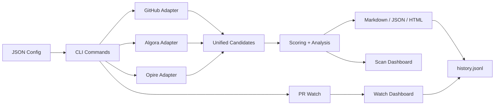

# Architecture

Open Bounty Radar keeps the core workflow local-first:

- adapters normalize external sources into candidate objects
- scoring and analysis stay explainable
- reports are generated as portable files
- dashboards are static HTML with optional local serving
- history is append-only JSONL for lightweight trend tracking
